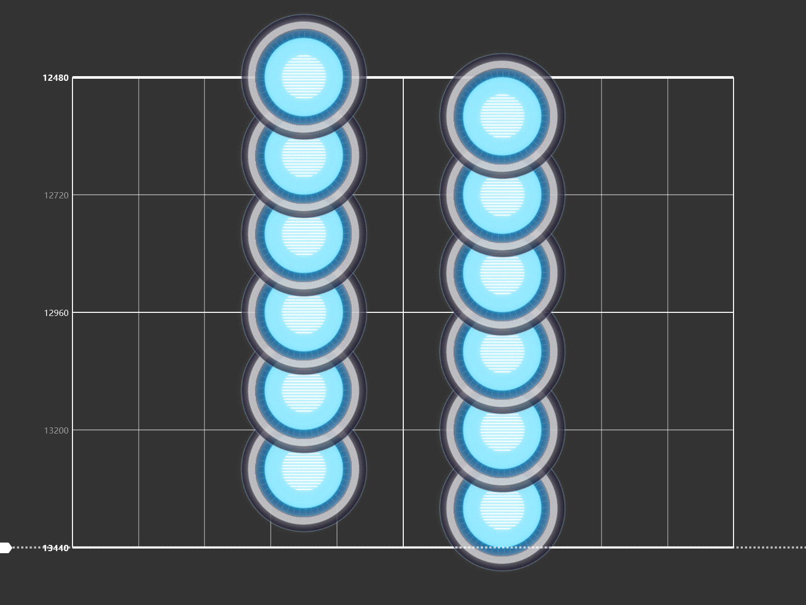
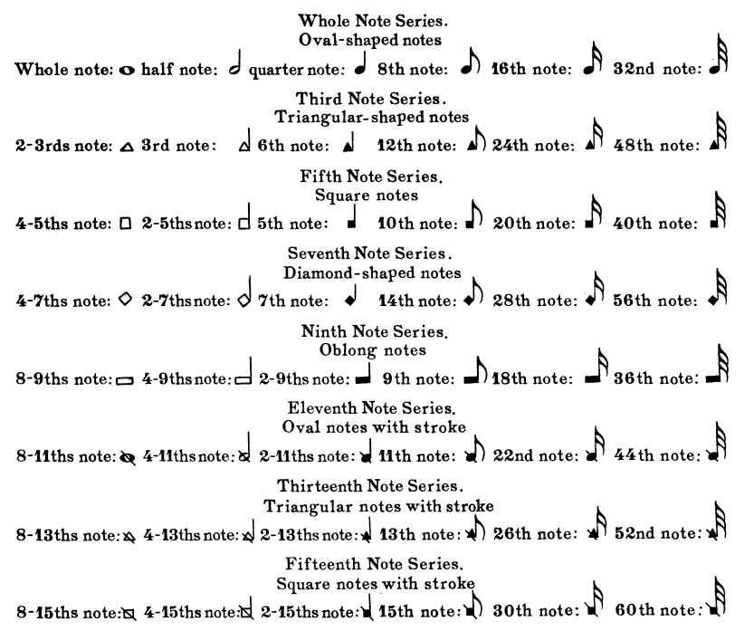
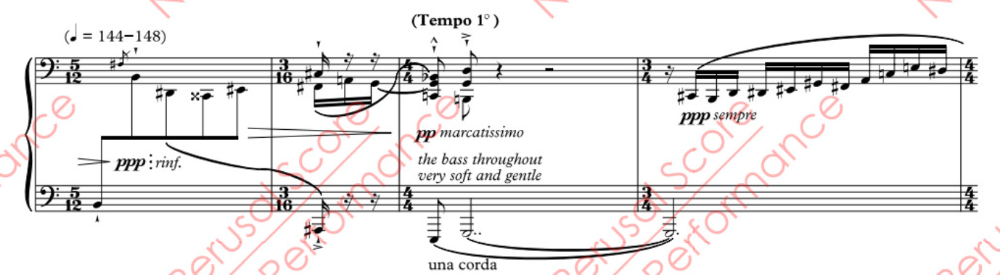
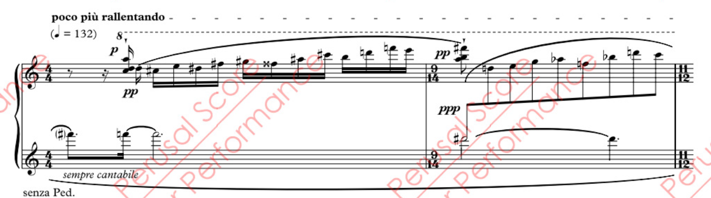
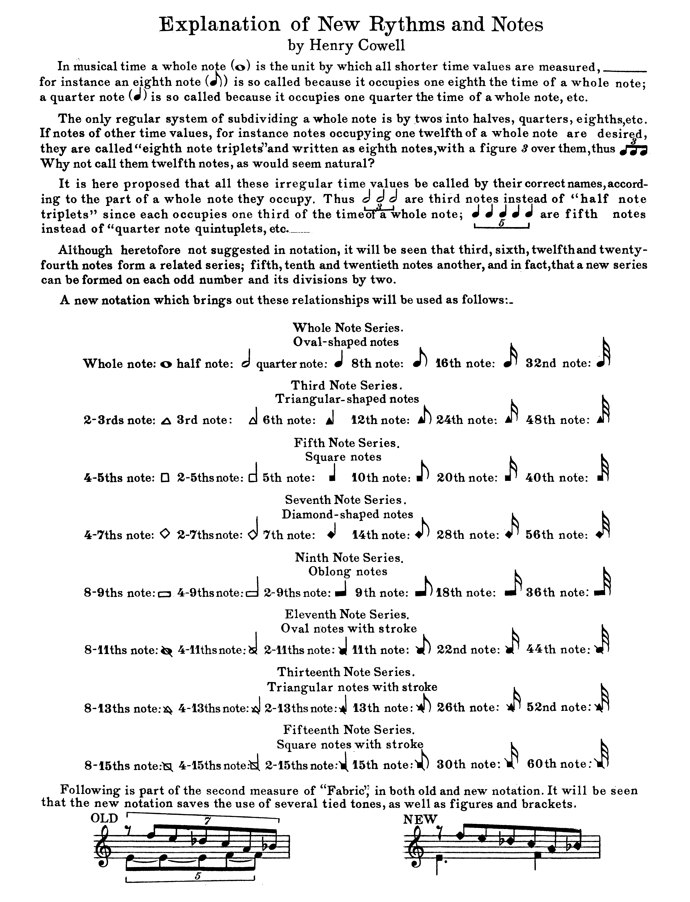
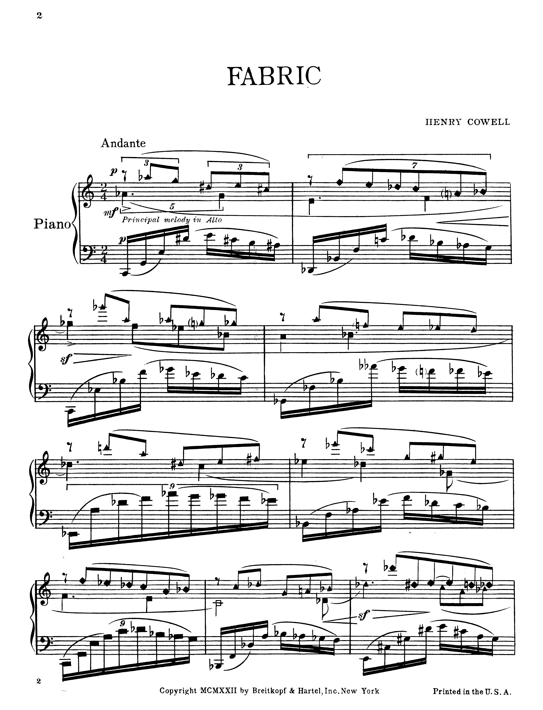
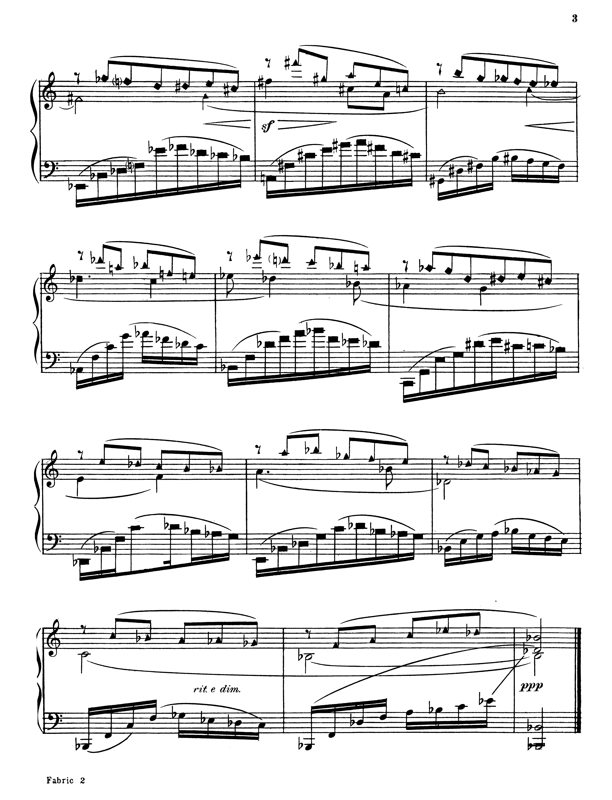

# 从音游中的12分、24分音符谈起：它们在乐理中存在吗？

在音乐游戏中，玩家经常会用“12分音符”、“24分音符”来描述密集节奏。这些表述是否在音乐理论体系中拥有明确的依据？

## 传统乐理中的节奏结构

现代的音乐记谱系统形成于16世纪。[音符时值](https://en.wikipedia.org/wiki/Note_value)表示音符的相对时长，通过音符头的纹理或形状、是否有符干以及是否有旗帜/连杆/钩/尾巴来表示。未修饰的音符时值是二的分数次幂，例如全音符、二分音符、四分音符等，如下表所示。

| 美式术语           | 英式术语       | 全音符的比例 |
| ------------------ | -------------- | ------------ |
| Whole note         | Semibreve      | $1$          |
| Half note          | Minim          | $1\over2$    |
| Quarter note       | Crotchet       | $1\over4$    |
| Eighth note        | Quaver         | $1\over8$    |
| Sixteenth note     | Semiquaver     | $1\over16$   |
| Thirty-second note | Demisemiquaver | $1\over32$   |

>  一个没用的小知识：256分音符叫"demisemihemidemisemiquaver"

由此可见，在标准术语中，并不存在“1/12”或“1/24”等分割单位的音符称谓。

## “12分”、“24分”术语的来源

### 音游社群中的习惯用语

由于X分音符的意思是全音符时值的X分之一，直观地，将全音符等分为12或24份，对应的时值为12分音符和24分音符。

在音游玩家社区中，这个说法是很常见的。下图是Cytus2中的一屏24分。

### DAW中的技术实现

在现代数字音频工作站（DAW）如 Ableton Live、Logic Pro、FL Studio 等软件中，节拍划分可精确至任意细分单位，例如1/6、1/12、1/24、1/32等。相关术语“12th note”、“24th note”在音序器中广泛使用，用于：

* 节奏量化（quantization）；
* 样本切分（sample slicing）；
* MIDI事件对齐。

## 作曲与先锋音乐中的实际应用

### Cowell 的 New Musical Resources

Henry Cowell 在1930年发布了 New Musical Resources of Music 一书，在书中，考威尔讨论了他在作品中使用的各种创新节奏和和声概念（以及其他仍完全是推测性的概念）。 他谈到了泛音列及“它在音乐历史上所产生的影响，所有时代的许多音乐材料都与之相关，以及通过各种方式以多种不同方式应用其原理，可以组装出丰富的音乐材料调色板。”这本书在随后的几十年里对美国音乐先锋派产生了深远影响。

他在这本书中论证了节奏与谐波之间的数学对应关系，提出了一大堆很先锋的东西，其中包括本文关心的12分音符。他在作品如 *[Fabric](https://imslp.org/wiki/Fabric,_HC_307_(Cowell,_Henry))*（1917）中实际使用了这些非标准的音符时值，如下图所示，~~符号非常的乱七八糟~~。

你看，24分音符一百多年前就有了。这种写法显著区别于传统的节奏体系，也使乐谱本身变得高度复杂和晦涩，我将其贴在本文最后。

### Thomas Adès: Traced Overhead

英国作曲家Thomas Adès在其钢琴作品 [Traced Overhead](https://www.fabermusic.com/music/traced-overhead-2708/) 中，大量使用了诸如5/12、7/12、3/10等非典型拍号，实质上相当于以“十二分音符”为最小节拍单位。

### Jason Alde 关于 The Sixth Note的讨论

在Jason Alder 的博客文章 [The Sixth Note: Dealing with Irrational Time Signatures](https://www.jasonalder.com/blog/2014/06/04/the-sixth-note-dealing-with-irrational-time-signatures/) 中，作者尝试从演奏实践的角度梳理和解构这些非标准拍号的应用。他将这些拍号称作 irrational time signatures，即“无理拍号”。

需要指出的是，此处的“无理”并不特指数学意义上的无理数（如$\sqrt{2}$），而是泛指那些不能通过常见分数结构简明地表示节奏比例的拍号（如5/6拍、7/12拍）。这类拍号往往用于临时构建不对称节奏片段，使得音乐呈现出瞬态的不稳定性与张力。

Alder 也指出，相比 Cowell 等先锋作曲家的系统性理论，这类写法在当代音乐中更多被视作表现手段，而非体系性的节奏架构。他建议演奏者以“等效时值换算”的方式处理这类节拍，即将其转译为可以与标准拍号对齐的比例结构，以便于阅读与演奏。

### Justeen Wheatley: The Use of Irrational Time Signatures

2019 年，Justeen Wheatley 提交的荣誉论文 [The Use of Irrational Time Signatures in Thomas Adès’ Works](https://www.researchgate.net/publication/339182496_The_Use_of_Irrational_Time_Signatures_in_Thomas_Ades'_Works) 对“无理拍号”（irrational time signatures）在当代先锋音乐中的运用，尤其是在英国作曲家 Thomas Adès 作品中的具体表现，进行了系统性的分析。该文在理论与实例之间架起了桥梁，对非标准节拍单位的理论根基、实践方式及其表达意图作出了深入阐释。

首先，论文明确指出，“irrational time signature” 一词虽以“无理”命名，却并不等同于数学中无法表示为有理数的“无理数”，而是指拍号中出现的分母非2的幂（如5、6、10、12等）。它们的“非理性”本质上在于它们打破了传统节奏单位二分结构的规范性，从而引发阅读与演奏上的挑战，但也为作曲者提供了更高的表达自由度。

论文援引了 Cowell 在 New Musical Resources 中的理论，即将泛音列所揭示的比例结构拓展至节奏领域，认为节拍亦可构建为类似谐波体系的比值组合。因此，使用如 2/6、3/10、5/12 等拍号，就相当于引入了与泛音结构“协调”的非等距节奏网格。Wheatley 特别指出 Cowell 对“2/6”和“2/4”两者的分析：前者与后者在听感上可能相近，但其强调的位置和内部节奏的张力完全不同。

Wheatley 接着通过分析 Adès 多部作品（如 Traced Overhead, Piano Quintet, Totentanz）归纳出 irrational time signatures 的三种主要用途：

* 辅助阅读（Ease of Reading）：相比传统附点或复合拍号，使用诸如 2/6、3/10 更直接反映复杂的 tuplets（切分音组），有时还能简化乐谱的连杆与节拍划分，使谱面更清晰。

* 制造混乱感（Tumultuous Passages）：在高潮段落中，通过不断变化的非标准拍号强化节奏不稳定感与结构张力。

* 节奏装饰（Rhythmic Ornamentation）：用于微妙地扭曲旋律节奏、延长短语、制造假象的加速与减速等，增强音乐表情。

此外，Adès 并非每次都一致采用完全的 tuplet 标记。有时他省略括号和数字，仅通过上下文和拍号提示（例如5/12中默认每拍为五连音）来推断节奏关系。这种做法虽然初看难以阅读，但也反映出他对演奏者节奏感知能力的信赖。

## 结语

术语虽未规范，实践已逐步确立。

虽然“12分音符”“24分音符”在传统乐理中没有术语规范，它们却早已在多个语境中获得实际功能。
从 DAW 到谱面，从玩家到作曲家，这些“非标准节奏单位”日益成为音乐语言的一部分，而不再只是辅助描述。

可以预见，未来的节奏理论体系将不得不面对这些“游离”于传统范畴之外的节奏实践，将其纳入更加包容的术语架构与教育体系中。

---

## 附：fabric全谱

> 参考文献：
>
> 1. Faber Music - Thomas Adès: [Traced Overhead](https://www.fabermusic.com/music/traced-overhead-2708/score)
> 2. Jason Alder - [The Sixth Note: Dealing with Irrational Time Signatures](https://www.jasonalder.com/blog/2014/06/04/the-sixth-note-dealing-with-irrational-time-signatures/)
> 3. Martineau, Jason. *The Use of Irrational Time Signatures*. (2019)
> 4. Cowell H. New musical resources[M]. Cambridge University Press, 1996.
