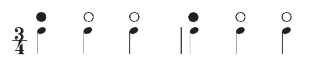
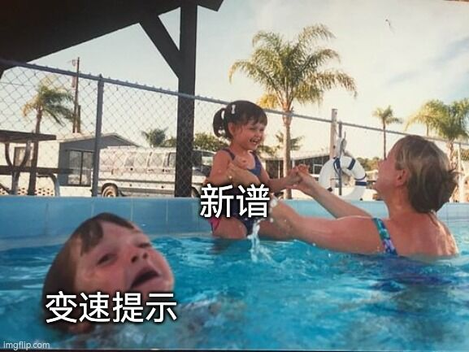

# 背景知识

## 乐理

制谱需要用到一定的乐理知识。一方面，正确辨识节奏能够显著地提高采音的效率和准确率，另一方面，使用合适的术语也有助于谱面交流。

你需要掌握的乐理知识包括常见的[节拍](https://zh.wikipedia.org/wiki/%E8%8A%82%E6%8B%8D)、[记谱方法](https://zh.wikipedia.org/zh-cn/%E4%BA%94%E7%B7%9A%E8%AD%9C)等。

### 小节和节拍

在音乐中，节拍指有规律地重复出现的重音。

Cytus II 谱面中的页面和音乐小节是对应的。在上一节中，我提到了时基 TimeBase 的默认值是 480 Tick，亦即一拍的长度是 480 Tick。音乐的节拍会影响一页的拍数，BPM 不变时，节拍会影响线速。

所以，正确辨认音乐的节拍非常重要。错误的节拍和错误的 BPM 一样致命，它们都会导致起拍点的偏移。

三拍子通常呈现出强弱弱或强弱弱次强弱弱的节奏，相对容易辨认。对于三拍子的音乐，常用的页长将是 720 Tick 和 1440 Tick。

对于更复杂的节拍，可以观察其重拍、旋律或乐句重复的周期，以此划分小节，根据小节内的拍数确定节拍和对应的页长。实际操作时，可以直接使用对应的页长，也可以按照旋律结构或其他依据，将特殊节拍拆解成不均匀的较短节拍来调整页长，以适应 Cytus II 的表达方式。一个直观的例子是 [BloodyMare](https://ct2view.the-kitti.com/chartlist/ivy001_009/chaos) 对七拍子的处理。

???+ info "X 分音"

    五线谱中，只有空心符头没有符杆和符尾的音符叫做全音符。
    
    带有空心符头和符杆的音符叫做二分音符。二分音符的时值为 $1\over2$ 个全音符。
    
    带有实心符头和符杆的音符叫做四分音符。四分音符的时值为 $1\over4$ 个全音符。
    
    在此基础上，每增加一根符尾，其时值便缩短一半，其名称亦为对应的X分音符。如八分音符、十六分分音符等。
    
    
    
    音游术语中，存在十二分音符、二十四分音符的说法，顾名思义，其时值为 $1\over12$ 或 $1\over24$ 个全音符。
    
    值得注意的是，在经典乐理中是没有“十二分音符”这类说法的，与之对应的是“三连音”。对于其他 X 分音，只要 X 不是 2 的幂，在乐理中对应的都是连音。
    
    不过，说音乐中不存在这样的说法是不准确的，相关讨论见[附录](../Appendix/IrrationalTimeSignatures.md)。
    
    
    
    对于四四拍的音乐，正常线速下（页长 960 Tick），一个全音符的时值相当于两页。
    
    <!--  -->

## 谱面

### 音符

> 对应 Cylheim 侧边栏的音符管理。

<!-- Cytus II 谱面中的 Note 由谱面文件中的 `note_list` 控制，在 Cylheim 中，音符管理统筹了 Note 的 ID、页面、Tick、类型、AR 等属性。 -->

Cytus I 只有 Click，Drag 和 Hold 三种 Note。在一代的基础上，二代添加了 Flick 和 Long Hold，丰富了音色的表现，并提供了对长音的支持。Cytus II 2.0 更新加入了 C-Drag（点锁）。

Cylheim 提供了 Down Click 和 Down Drag 两种 Note，在官谱中，这些 Note 仅用于和 Deemo 系列相关的 DREAM 和 DROP 难度谱面中。不建议在常规谱面中使用这些下落式 Note。

Cytus II 谱面对采音的要求是较高的，一般要求 Note 和音乐严格对应。

需要注意，Note 不能超过谱面边界。除了 Drag 和 C-drag 的滑动节点外，不允许 Note 重叠。

以下类型的 Note 是非法的：

- 不以锁链头或点锁头为起始的锁链、不以锁链节点或点锁节点为结束的锁链、锁链头与点锁头数量之和大于 1 的锁链、含有非锁链类 Note 的锁链。

- 非跨屏的 Long Hold。

!!! info "AR"
    修改 AR（Approach Rate）会影响 Note 的渐入速度，效果仅在开启了“使用 Cytoid 的动画模式”时可见。修改 AR 可用于降低高速段的读谱压力，或辅助达成某些演出效果。

    请注意，AR 不是 Cytus II 原生支持的属性，仅在 Cytoid 中有效，在 CFHSS 这类较严肃的比赛中是被禁止的。

### 扫描线

> 对应 Cylheim 侧边栏的速度管理和页面管理。

这里的部分知识在“准备工作”的“重拍对齐”一节中已经提到过了，我把它贴在下面以便查阅。

??? info "BPM 及相关概念"
    这里引用了 [Cytus II 谱面格式详解](https://cytoid.wiki/zh/charting/chart-json.html)的部分内容。
    - BPM：Beats Per Minute，每分钟节拍数。
    - Tick：Cytus II 谱面采用的重要单位，用于对元素进行时间定位。
    - TimeBase：时基，表示一拍的 Tick 长度，默认为 480。
        - 显然，你可以由此得出不同节拍音乐需要的页长。
    - Tempo：速度，表示一拍的持续时间。Cytus II 谱面中记录当前速度的属性。
        - Tempo 和 BPM 存在转换关系
        $$ \text{Tempo}=\frac{60,000,000}{\text{BPM}}$$
        其中 60,000,000 指的是一分钟的微秒数。
    - Pagesize：页面长度，表示一页的 Tick 数。
    - Scanline：线速，扫描线速度。
        - 扫描线速度是对当前线速的直观描述，页长或 BPM 变化都会导致线速变化。将当前的页长视为 960 Tick，等效的 BPM 即为我们平时说的线速。
        $$ \frac{\text{960}}{\text{Scanline}}=\frac{\text{Pagesize}}{\text{BPM}}$$

Cytus II 中扫描线的行为由页面和速度共同控制。

在 Cylheim 中，页面管理统筹了所有页面的起止 Tick、页面方向、页面参数等属性，速度管理记录了每个速度变化对应的 Tick、Tempo 和 BPM。

当音乐存在 BPM 变化时，你需要调整 Tempo（亦即 BPM），使得扫描线的速度和音乐一致。

当音乐存在节拍变化时，你需要调整页长，每拍对应一倍的TimeBase（默认值 480），使得一页内的拍数与音乐的小节对应。

当你需要进行倍速或半速，你应当相应地减半或加倍页长，而不是修改 Tempo。

当你需要进行扫描线演出时，渐变速可以利用 Tempo 的插值实现，方向变化可以通过调整页参实现。

以下类型的页面和扫描线属性是非法的：

- 0 Tempo。
- 任何小于 0 的 Tick。
- 相邻两页中前一页的结束 Tick 与后一页的起始 Tick 不同。

页面管理有一项“调整谱面长度”的功能，当你由于种种原因发现页面不够用或者过剩的时候（通常是没有正确设置 BPM 的时候），你可以使用它来调整谱面的总长度。

### 事件

> 对应 Cylheim 侧边栏的事件管理。

事件主要分为三类。

速度变化事件是我们常说的“变速提示”。变速提示的位置是速度变化前的两拍，类型由当前的线速决定，参数由线速和基准线速参考点的差异决定。

不知道变速提示放哪里？没关系，Cylheim 可以一键生成变速提示，并提供了可以调整的参数。

变速提示的默认位置是线速变化两拍之前（也就是480 Tick 之前）。如果你想要自己放置变速提示，请遵守这一规范。请不要在没有发生对应速度变化的地方使用变速提示，追求演出效果可以使用自定义事件。

别忘了给你的谱面加上必要的变速提示！

UI 事件控制了 Cytus II 游玩界面的一些 UI，具体效果可以参考部分官谱的演出。

需要注意的是，Cytoid 对自动转换的 UI 事件支持较弱，扫描线以外的部分只支持统一的显示和隐藏。

文字提示事件可以在底部显示文字。

!!! warning "滥用警告"
    不要滥用扫描线和事件的演出，尤其是你还不太清楚怎么提高谱面本身表现力的时候。

    在本身平平无奇的谱面上使用过头的特效可能会产生浮夸且可笑的效果。
