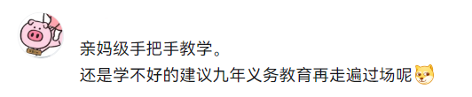

# 准备工作
 
## 工作流程

偶遇一首激发了你创作欲的音乐，到谱面完成、上架 [Cytoid 社区](https://cytoid.io)，有哪些步骤？

- 获取音频，测定 BPM，处理音频，以得到正确的文件格式和长度。
- 准备一张合适的曲绘，记录音频和曲绘的 metadata (作者、发布路径等)。
- 使用制谱器创作谱面。*~~这听起来很轻松~~*
- 打包和发布谱面。

## 工作环境

在这里，我会列出你可能需要的大部分软件，你需要提前准备好这些软件以及其运行环境，并对软件的使用有一定程度的了解。

几乎所有相关软件的使用文档或教程视频都能够在互联网上获取。一部分软件资源可以在 Cytoid 官方群群文件找到。

我会在附录中举例介绍一些软件的使用方法和注意事项，可供参考。

### 音频工具

免费开源的 [Audacity](https://www.audacityteam.org/) 或 Fl Studio、Adobe Audition 等，可以使用[格式工厂](http://www.pcfreetime.com/formatfactory/CN/index.html)辅助格式转换。

### BPM工具

[MixMeister BPM Analyzer](https://www.mixmeister.com/bpm-analyzer.html) 或其他可以测定BPM的软件、网站（如 [TimingAnlyz](https://osu.ppy.sh/users/126198)、[BPM 查询器](https://vocalremover.org/zh/key-bpm-finder)）。

### 制谱工具

**Cylheim** （从 [Microsoft Store](https://www.microsoft.com/zh-cn/p/cylheim/9pcczswg973k) 或 [Github](https://github.com/Horiztar/Cylheim-Windows/releases) 获取，使用方法参见[wiki](https://github.com/Horiztar/Cylheim-Windows/wiki)和[视频教程](https://www.bilibili.com/video/BV1Ly4y1m7Np)）




## 音频处理

### 格式

获取的音频文件通常为 MP3 或 FLAC 格式，推荐在制作谱面和打包时使用 **OGG** 格式的音频文件。

WAV 格式的音频同样适用于制作谱面，但由于其较高的空间占用，不建议在打包发布时使用。基于同样的理由，打包时应避免使用高码率的音频。

!!! warning "关于 MP3 格式"
    请注意，MP3 格式的音频文件很可能导致延迟变化，在 Cylheim 和 Cytoid 中的表现不稳定，**请勿使用**。

### BPM

在 Cytus II 谱面中，速度和音乐的 BPM（beats per minute）强相关，其值通常为 BPM 的 $2^n$​ ​倍。你可以使用 MixMeister BPM Analyzer 测定音乐 BPM，也可以通过其他途径寻找参照。某些网站会提供音乐的 BPM 信息（如 [sdvx.in](https://sdvx.in/) ），还可以通过 BMS 格式的谱面获取 BPM（推荐 [BMS SEARCH](https://bmssearch.net/) 和 [iBMSC](https://www.cs.mcgill.ca/~ryang6/iBMSC/) ）。

你也可以手动测量 BPM，具体操作是在音频处理软件中测算音乐小节的长度，然后换算到对应的 BPM 值。如果音乐中存在变化的 BPM，你可以查找其他音游相关谱面的 BPM 表，或者手动测量。

请不要使用错误或误差较大的BPM制作谱面。

!!! info "BPM 及相关概念"
    这里引用了 [Cytus II 谱面格式详解](https://cytoid.wiki/zh/charting/chart-json.html)的部分内容。
    
    - BPM：Beats Per Minute，每分钟节拍数。
    - Tick：Cytus II 谱面采用的重要单位，用于对元素进行时间定位。
    - TimeBase：时基，表示一拍的 Tick 长度，默认为 480。
        - 显然，你可以由此得出不同节拍音乐需要的页长。
    - Tempo：速度，表示一拍的持续时间。Cytus II 谱面中记录当前速度的属性。
        - Tempo 和 BPM 存在转换关系 
        $$ \text{Tempo}=\frac{60,000,000}{\text{BPM}}$$
        其中 60,000,000 指的是一分钟的微秒数。
    - Pagesize：页面长度，表示一页的 Tick 数。
    - Scanline：线速，扫描线速度。
        - 扫描线速度是对当前线速的直观描述，页长或 BPM 变化都会导致线速变化。将当前的页长视为 960 Tick，等效的 BPM 即为我们平时说的线速。
        $$ \frac{\text{960}}{\text{Scanline}}=\frac{\text{Pagesize}}{\text{BPM}}$$

### 重拍对齐

Cytus II 谱面和音乐的小节是相关的，页面边缘对应小节线。

你需要正确处理音频，让音乐的第一个 **重拍** 落在页面边缘。这个步骤也叫对齐起拍点。

每一页面的时间为
$$\frac {120} {\rm Scanline} \rm s
$$
Scanline 为当前扫描线速度。你需要在音频处理软件中定位第一个重拍的位置，通过在开头增加或减少空白的方式，使得第一个重拍的时间为起始页面时间的整数倍。Cytus II 扫描线出现动画需要一整页来播放，请确保第一个音（或第一个 note）在第二页或之后出现。

- 音乐的第一个音可能是弱拍，不是完整小节的开始（参阅：[弱起小节](https://zhuanlan.zhihu.com/p/89747708)），你需要向后寻找一个可参考的重拍，可以考虑节奏鲜明的鼓。同理，如果你在音乐的开头找不到良好的参照，也可以向后寻找重拍。计算时需要留意第一个音的位置。
- **不推荐** 调整页长或速度来代替音频处理的做法。
- Cylheim 自带的延迟调整仅供播放预览使用，不写入谱面属性，使用它来调整延迟会导致最终产出的谱面有严重的延迟问题。
- 导出音频时请注意格式。
- 参考[视频教程](https://www.bilibili.com/video/BV1a94y1L7jn/)

!!! info "重拍对齐"
    在上一个 info 块中，我介绍了 BPM 及相关概念。理解这些概念对正确实现重拍对齐非常重要。
 
    如果你已经阅读过 Cylheim 的教程，你会意识到 Cylheim 中变拍、半速和倍速都是通过改变页长（Pagesize）实现的。当页长为默认值 960 Tick 时，扫描线速度为当前 BPM 对应的正常值。当页长加倍时，线速减半，而 BPM 不变。如果你的谱面以半速开始，你填入的 Scanline 应该为 BPM 的两倍。

    对于并非四拍子的音乐，以三拍子为例，常用的页长将是 720 Tick 和 1440 Tick。如果你不能理解先前的线速换算，这里我提供另一个可以使用的算式：
    
    $$
    \frac{60\times拍}{\text{BPM}}秒
    $$
    
    在重拍前留空这一数值或其整数倍的长度是合适的。


### 剪歌

音游曲的长度一般介于 90 秒和 180 秒，过长或过短的音频会影响谱面的创作和游玩体验。

不同于重拍对齐，剪歌时你可以剪去一些段落，在不影响音乐结构的情况下减少长度。重复段或复现的段落都可以作为剪歌的切入点，也可以通过叠加过渡音轨的方式减弱拼接感。

剪歌是相对困难的，需要你对音乐有一定理解，这里我不详细展开。

可供参考的实例：Arcaea 对 Tempestissimo 的处理（[cut](https://www.bilibili.com/video/BV1tt4y1C7BG/) / [uncut](https://www.bilibili.com/video/BV1Yy4y1v7jC/)）

### 其他注意事项

- 打包发布时需要一段 15 秒左右的预览音频，建议截取较突出的段落，可以加上淡入和淡出。
- 不是所有的音乐都适合 Cytus II 谱面的表现形式，请自行甄别。
- 请避开有版权问题的音乐，如 Cytus、Cytus II 收录曲、Arcaea 版权曲等。部分曲师不允许使用他们的作品进行自制。如果你已经完成了谱面，请不要在社区公开。
- [CYTOID BLACKLIST/WHITELIST](https://docs.google.com/spreadsheets/d/1tWktIWXCcCo9_qyo-TJMNVeuYrFFPL71BL0zB5ve-5U/edit#gid=0)


## 文件汇总

为你的谱面选择一张JPG或PNG格式背景图，推荐 4:3 或 16:9 的长宽比，分辨率适中。图片可以是单曲或专辑的封面，也可以是题材相关的内容（也可以是完全无关的东西）。

请记录画师、曲绘URL等信息，稍后你需要在 metadata 中填写这些信息。

现在，检查你的工程文件夹，现在你应该有一份对齐了起拍点、有 BPM 信息的 OGG 格式音频，有一张曲绘，可能有一份预览音频。你可以进入 Cylheim ，按照教程中介绍的方法创建一个项目，添加一个谱面，填写相关信息。你的项目文件结构如下：

```
.
├─ CylheimProject     // Cylheim 的缓存目录     
│  ├─ AutoSave        // Cylheim 的自动保存目录
│  ├─ Backups         // Cylheim 的自动备份目录
│  └─ MediaTemps      // Cylheim 的音频缓存目录
├─ CylheimProject.cyl // Cylheim 工程文件（个人推荐将工程文件重命名为曲名）       
├─ Chaos.json         // 谱面文件               
├─ bg.png             // 背景图片文件   
├─ music.ogg          // 音频文件               
├─ pre.ogg            // 预览文件（可选）               
└─ ...           
```

