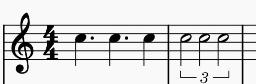

# 采音

在这一节中，我将介绍 Cytus II 中基本的采音准则。

## 准确

准确是 Cytus II 采音的第一要义。大部分情况下，Cytus II 谱面中的 Note 都需要和具体的音相对应，且摆放着正确的时间点上。

Note 和音乐发生偏差的现场称为 zure（ズレ，misalignment）。写谱过程中要尽量避免 zure 的产生。

部分音游中存在名为 dump （采空音）的技巧，这在 Cytus II 中是不可以使用的。

!!! info 采音技巧
    Cylheim 自带的慢放功能可以有效地提高采音的准确性，建议在采音或检查时使用 0.5x 或更低的播放速度。

    
### 
