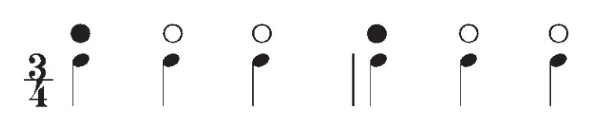

# 初探：新手上路

## 知识准备

### 乐理基础

制谱需要用到一定的乐理知识，一方面，辨识节奏能够显著地提高采音的效率和准确率，另一方面，使用术语有助于沟通。

你需要掌握的乐理知识包括常见的[节拍](https://zh.wikipedia.org/wiki/%E8%8A%82%E6%8B%8D)、[记谱方法](https://zh.wikipedia.org/zh-cn/%E4%BA%94%E7%B7%9A%E8%AD%9C)等。
??? info "小节和节拍"
    Cytus II 谱面中的页面和乐曲小节是对应的。在上一节中，我提到了时基 TimeBase 的默认值是 480 Tick，亦即一拍的长度是 480 Tick。
    

    对于四三拍的乐曲，常用的页长将是 720 Tick 和 1440 Tick 。
    
    正确辨认乐曲的节拍非常重要，错误的节拍和错误的 BPM 一样致命。
    
    三拍子通常呈现出强弱弱或强弱弱次强弱弱的节奏，相对容易辨认。
    
    
    
    对于更复杂的节拍，可以观察其旋律或乐句重复的周期，并将其按照结构拆解成较短的节拍。

??? info "X 分音"
	五线谱中，只有空心符头没有符杆和符尾的音符叫做全音符。
    

    带有空心符头和符杆的音符叫做二分音符。二分音符的时值为 $1\over2$ 个全音符。
    
    带有实心符头和符杆的音符叫做四分音符。四分音符的时值为 $1\over4$​ 个全音符。
    
    在此基础上，每增加一根符尾，其时值便缩短一半，其名称亦为对应的X分音符。如八分音符、十六分分音符等。
    
    
    
    音游术语中，存在十二分音符、二十四分音符的说法，顾名思义，其时值为 $1\over12$ 或 $1\over24$ 个全音符。
    
    需要注意的是，在乐理中是没有“十二分音符”这类说法的，与之对应的是“三连音”。对于其他 X 分音，只要 X 不是 2 的幂，在乐理中对应的都是连音。
    
    
    
    对于四四拍的乐曲，正常线速下（页长 960 Tick），一个全音符的时值相当于两页。
    
    <!--  -->

### Cytus II 谱面基础

写谱并不需要很高的游玩水平，相对的，写谱要求的是较丰富的游玩经验和充分的观察和思考。

在写谱之前，你需要回答两个问题：

!!! question
    一张合格的Cytus II 谱面是什么样的？

    一张优秀的Cytus II 谱面是什么样的？

